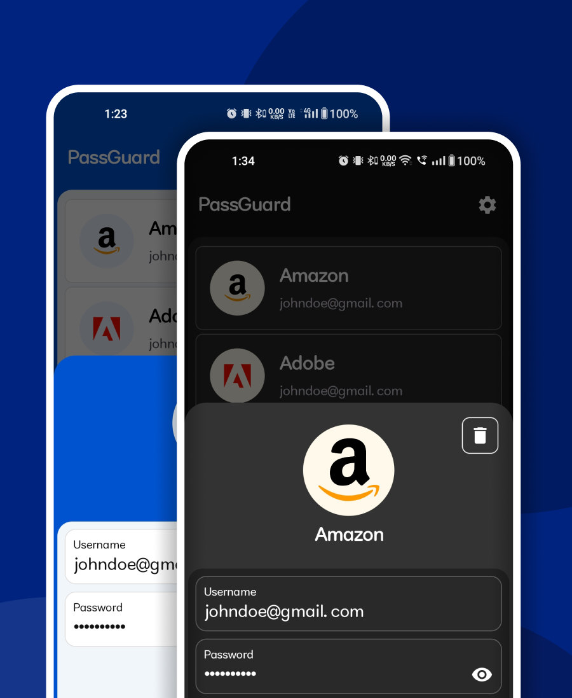
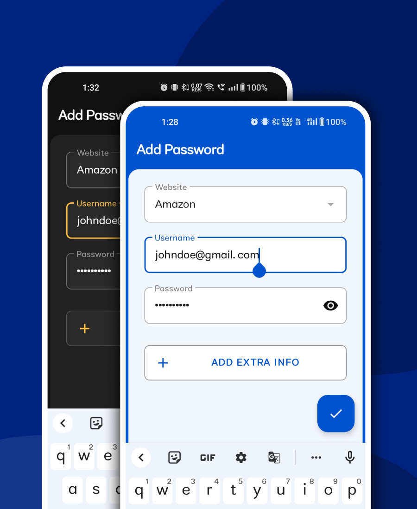

## Uncompromised Security

In PassGuard, every password is encrypted using the rock-solid AES encryption algorithm, the same encryption trusted by governments and top security experts worldwide. The user's data remains under their control, with no uploads to external servers, ensuring that their sensitive information stays private and safe.

## Effortless Biometric Authentication

Every time, the user launches the app or tries to do any sensitive action, like viewing a password or editing a password, a biometric authentication prompt is shown where the user can scan their fingerprint or enter their device credentials. i.e. pattern, password, or pin. Adding extra security so that only the user can access their passwords.

## Backup and Recovery

Let's say the user wants to transfer his passwords to another phone or maybe he is trying to format his phone, or any scenario where their passwords may get deleted or they can lose all their phone data. PassGuard is completely offline, all the data is stored only on the user's phone. There is no backup on any server. PassGuard offers an export/import feature, through which the user can export all of their passwords in a text file which is encrypted with a secure key that is only known to the user. While importing the passwords, the user will select the encrypted file and then they have to enter the secure key shown while exporting the passwords. After entering the secure key, if the secure key is valid, all the passwords from the encrypted file will be added to the password list.

## Beautiful UI and Dark/Night mode support

PassGuard uses the Material Design Library to create a very clean and pleasing aesthetic. It also supports dark/light theme which is selected based on the system's theme. The UX is very intuitive and there are no complicated user flows. Everything just works as expected.

